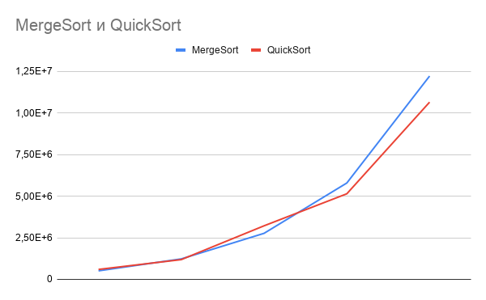
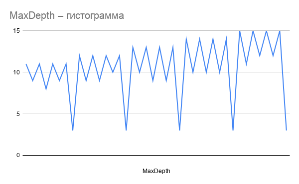
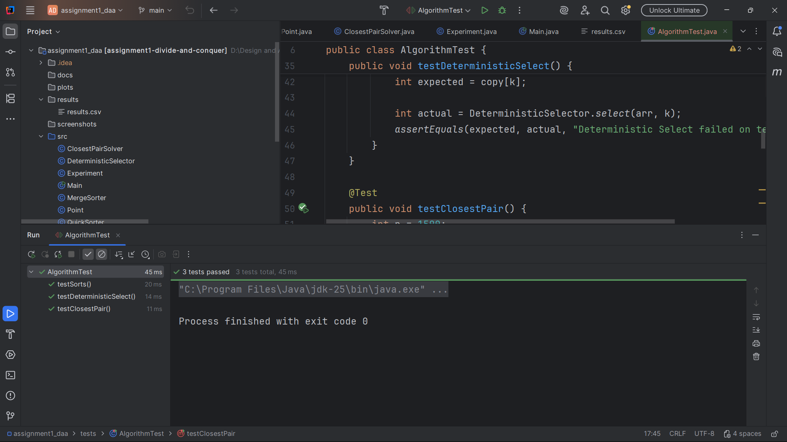
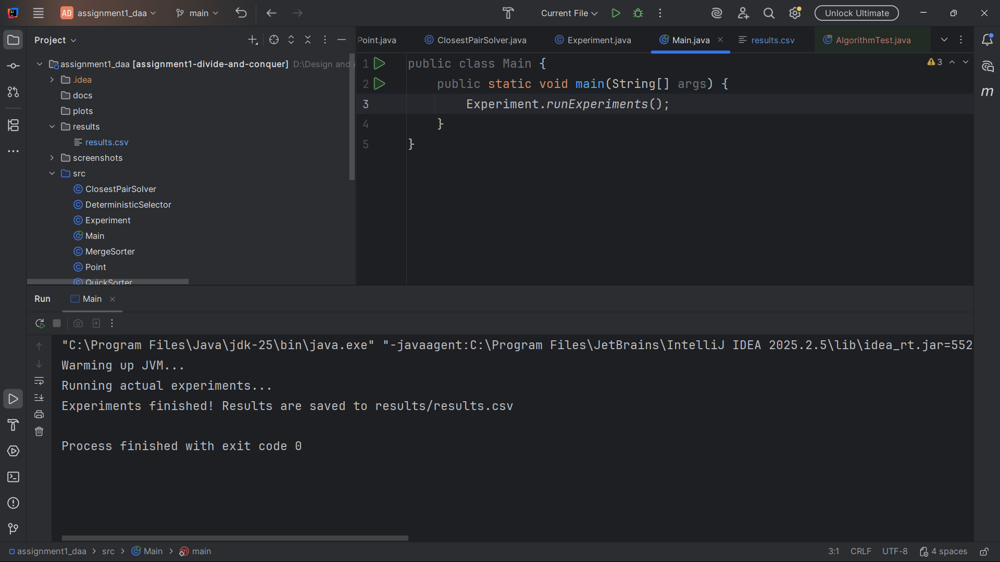

# Assignment 1: Divide-and-Conquer Algorithm Analysis

## A. Project Overview
The purpose of this assignment is to implement and analyze four classic divide-and-conquer algorithms: MergeSort, QuickSort, Deterministic Select (Median-of-Medians), and Closest Pair of Points. The project includes theoretical complexity analysis, practical performance benchmarking (execution time, recursion depth, and operations count), and correctness testing.

## B. Algorithm Analysis

### 1. MergeSort
*   **How it works:** Divides the array into two halves, recursively sorts them, and merges them using a reusable auxiliary buffer. For small subarrays, it falls back to Insertion Sort.
*   **Time Complexity:** $\Theta(n \log n)$ in all cases.
*   **Space Complexity:** $O(n)$ for the auxiliary buffer and $O(\log n)$ for the recursion stack.
*   **Recurrence (Master Theorem):** $T(n) = 2T(n/2) + O(n)$. According to the Master Theorem (Case 2, where $a=2, b=2, d=1$, so $a = b^d$), the time complexity is strictly $\Theta(n \log n)$.

### 2. QuickSort
*   **How it works:** Selects a randomized pivot, partitions the array in-place, and recursively sorts the smaller partition while iterating over the larger one to limit stack depth.
*   **Time Complexity:** $O(n \log n)$ on average, $O(n^2)$ in the worst case.
*   **Space Complexity:** $O(\log n)$ worst-case recursion depth (due to the smaller-first tail recursion optimization).
*   **Recurrence:** Average case is $T(n) = 2T(n/2) + O(n) \implies O(n \log n)$. Worst case is $T(n) = T(n-1) + O(n) \implies O(n^2)$.

### 3. Deterministic Select (Median-of-Medians)
*   **How it works:** Divides the array into groups of 5, finds the median of each group, recursively finds the median of those medians, and uses it as a pivot to partition the array. It then recurses only into the partition containing the $k$-th element.
*   **Time/Space Complexity:** Time is $O(n)$ worst-case. Space is $O(\log n)$ for the recursion stack.
*   **Recurrence (Akra-Bazzi intuition):** $T(n) \le T(n/5) + T(7n/10) + O(n)$. Since $1/5 + 7/10 = 9/10 < 1$, the work strictly decreases geometrically at each level, dominating at the root, which yields $O(n)$.

### 4. Closest Pair of Points
*   **How it works:** Sorts points by x-coordinate initially. Recursively divides the set in half, finding the minimum distance in both halves ($\delta$). It then merges the halves by y-coordinate (MergeSort style) and checks a strip of width $2\delta$ at the boundary.
*   **Time Complexity:** $\Theta(n \log n)$ (Because we sort by X once $O(n \log n)$, and the recurrence step only does linear merging $O(n)$).
*   **Space Complexity:** $O(n)$ for the auxiliary array used during the merge step.
*   **Recurrence (Master Theorem):** $T(n) = 2T(n/2) + O(n)$ (linear merge step). Master Theorem Case 2 applies, yielding $\Theta(n \log n)$.

## C. Experimental Results
*Results are saved in the `results/results.csv` file.*

**(Insert your plots here by replacing these placeholders with actual paths to your images in the plots folder)**

## D. Discussion

*   **Do the results match theoretical complexity?** Yes. The execution time of MergeSort scales linearlyithmically ($n \log n$). QuickSort is generally faster by a constant factor due to better cache locality, despite the same asymptotic average complexity.
*   **How does input structure affect performance?** Sorted and reverse-sorted arrays trigger different partition splits in QuickSort. However, our randomized pivot ensures that we avoid the $O(n^2)$ worst-case even on sorted data. Duplicate-heavy arrays are handled efficiently by our partition logic, though they can increase redundant comparisons.
*   **Why does smaller-first recursion help QuickSort?** By explicitly making a recursive call only for the smaller partition and using a `while` loop for the larger one, we guarantee that the size of the array passed to the recursion stack is at most half the current size. This strictly bounds the maximum call stack depth to $O(\log n)$, preventing `StackOverflowError` even if the time complexity degenerates to $O(n^2)$.
*   **Why does Median-of-Medians guarantee $O(n)$?** It guarantees a good pivot. By taking the median of medians, we mathematically ensure that at least 30% of the elements are smaller than the pivot and at least 30% are larger. This guarantees the recursion tree depth is logarithmic and the subproblem size shrinks by a constant fraction, preventing the $O(n^2)$ worst-case of randomized QuickSelect.
*   **Why is divide-and-conquer Closest Pair faster than $O(n^2)$ for large inputs?** The $O(n^2)$ brute-force method calculates the distance between every possible pair. The divide-and-conquer approach limits the search: we only check points across the dividing line if they fall within a narrow strip of width $2\delta$. Furthermore, geometric packing guarantees we only need to check at most 7 points for each point in the strip, reducing the merge step to $O(n)$.
*   **What practical factors affect performance?**
    *   **JIT Compiler:** Early runs are slower because the JVM interprets the bytecode. After our "warm-up" phase, the JIT compiles hot paths to native machine code, drastically reducing execution time.
    *   **Garbage Collection (GC):** Object allocations (like creating the `aux` arrays) trigger GC. Reusing a single auxiliary buffer in MergeSort reduces memory allocation overhead and GC pauses.
    *   **Cache Locality:** QuickSort operates entirely in-place and accesses memory sequentially, which is highly friendly to CPU caches (L1/L2). MergeSort copies data back and forth between arrays, causing more cache misses.

## E. Reflection
Implementing these algorithms highlighted the gap between theoretical asymptotic complexity and practical performance. The main challenge was ensuring that the Closest Pair algorithm strictly adhered to $\Theta(n \log n)$ by merging Y-coordinates during the recursive return, rather than re-sorting the strip from scratch (which would degrade it to $O(n \log^2 n)$). Additionally, implementing the tail-recursion optimization for QuickSort was an excellent exercise in understanding JVM memory management and stack depth limitations.

## F. Screenshots
**(Insert your screenshots here)**

